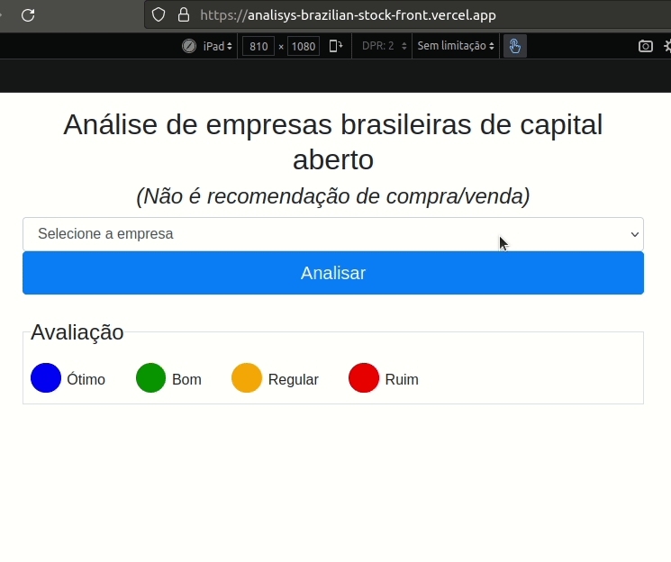
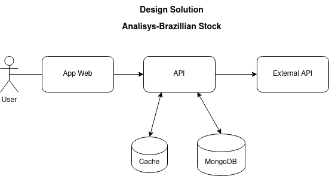

# spring-boot-brazilian-stock-analisys

> Spring boot with Kotlin, Spring Boot, Cache, WebClient, Swagger and Heroku Cloud

# Demo


# Deployed to Vercel (front)
https://analisys-brazilian-stock-front.vercel.app/

## Design Solution


## Run Application
`mvn spring-boot:run`

## Run all tests with maven
`mvn test`

## Run all tests with newman
### If you don't have newman installed, install it with npm:
`npm install -g newman`
`npm install -g newman-reporter-htmlextra`
### Run all testes with newman
`newman run postman/postman_collection.json`
### Run all testes with newman report
`newman run postman/postman_collection.json -r cli,htmlextra --reporter-htmlextra-export ./postman/report_postman_collection.html
`

## Update all libs from project
`mvn versions:use-latest-releases`

## Swagger localhost documentation

http://localhost:8888/swagger-ui/index.html#

## Swagger heroku documentation

https://analisys-brazilian-stock.herokuapp.com/swagger-ui/index.html#

## Postman

> <code>[postman/postman_collection.json](postman/postman_collection.json)</code>

## application.yml

```yaml
config:
  setoresParenes: [
    "utilidade-publica",
    "materiais-basicos",
    "financeiro-e-outros",
    "saude"]
  minimoFreeFloat: 25.00
  minimoROE: 10.00
  minimoCagrLucro5anos: 15.00
  minimoMargemLiquida: 10.00
  minimoLiquidez: 1
  maximoDividaLiquidaSobrePatrimonioLiquido: 2.00
  maximoDividaLiquidaSobreEbitda: 2.50
  maximoPrecoSobreLucro: 15.00
  maximoPrecoSobreValorPatrimonial: 3.00

  databaseName: ${DATABASE_NAME}
  urlDatabase: ${URL_DATABASE}
  timeoutDatabase: 60000

  urlExternalAPI: ${URL_EXTERNAL_API}
  timeoutExternalAPI: 60000
  timeMinRetry: 2000
  timeMaxRetry: 5000
  maxAttempsRetry: 3

  messageTickerNotFound: "Sorry, the ticker not found!"
  messageConnectionFail: "Sorry, the connection whith external API is fail. Retry again after 1 minute!"

server:
  port: 8888

logging:
  level:
    ROOT: INFO
```

## StockAnalisysDTO.java

```kotlin
data class StockAnalisysDTO(
    val ticker: String,
    val estaEmSetorPerene: Boolean,
    val estaForaDeRecuperacaoJudicial: Boolean,
    val possuiBomNivelRetornoSobrePatrimonio: Boolean,
    val possuiBomNivelCrescimentoLucroNosUltimos5Anos: Boolean,
    val possuiBomNivelMargemLiquida: Boolean,
    val possuiBomNivelMargemEbit: Boolean,
    val possuiBomNivelDeCapacidadeDeQuitarDividaNoCurtoPrazo: Boolean,
    val possuiBomNivelDividaLiquidaSobrePatrimonioLiquido: Boolean,
    val possuiBomPrecoEmRelacaoAoValorPatrimonial: Boolean,
    val possuiBomNivelPassivosSobreAtivos: Boolean,
    val nomeEmpresa: String? = null,
    val segmentoEmpresa: String? = null,
    val score: Score? = null
) {
    override fun toString(): String {
        return "StockDTO(\"ticker\":\"${ticker}\",\"estaEmSetorPerene\":${estaEmSetorPerene},\"estaForaDeRecuperacaoJudicial\":${estaForaDeRecuperacaoJudicial},\"possuiBomNivelRetornoSobrePatrimonio\":${possuiBomNivelRetornoSobrePatrimonio},\"possuiBomNivelCrescimentoLucroNosUltimos5Anos\":${possuiBomNivelCrescimentoLucroNosUltimos5Anos},\"possuiBomNivelMargemLiquida\":${possuiBomNivelMargemLiquida},\"possuiBomNivelDeCapacidadeDeQuitarDividaNoCurtoPrazo\":${possuiBomNivelDeCapacidadeDeQuitarDividaNoCurtoPrazo},\"possuiBomNivelDividaLiquidaSobrePatrimonioLiquido\":${possuiBomNivelDividaLiquidaSobrePatrimonioLiquido},\"possuiBomPrecoEmRelacaoAoValorPatrimonial\":${possuiBomPrecoEmRelacaoAoValorPatrimonial},\"nomeEmpresa\":\"${nomeEmpresa}\",\"segmentoEmpresa\":\"${segmentoEmpresa}\",\"avaliacaoGeral\":\"${score.toString()}\")"
    }
}
```

## StockService.java

```kotlin
@Service
class StockService(val port: StockPort) {
    @Cacheable(value = ["analise"])
    fun getAnalisys(ticker: String): Mono<StockDTO> {
        return port.getAnalisys(ticker)
    }
}
```

## StockController.java

```kotlin
@CrossOrigin(origins = ["*"])
@RestController
@RequestMapping("/stock")
@Api(description = "Analise de empresa brasileira de capital aberto")
class StockController @Autowired constructor(val service: StockService) {
    @GetMapping("/analisys/{ticker}")
    fun getAnalisys(@PathVariable ticker: String) = service.getAnalisys(ticker.toUpperCase())
}
```

## StockControllerTest.java

```kotlin
@SpringBootTest
@AutoConfigureMockMvc
class StockControllerTest(@Autowired val mockMvc: MockMvc) {
    private val urlValidApi: String = "/stock/analisys/"
    private val urlInvalidApi: String = "/stock/analisys/ticker/"
    private val exampleValidTicker: String = "ABEV3"
    private val exampleInvalidTicker: String = "ABEVV"
    private val exampleNotExistTicker: String = "ABEV6"

    @Test
    fun findAnalisysWhenUrlValidApiAndExampleValidTickerReturnIs200Code() {
        mockMvc.perform(
            get("${urlValidApi}${exampleValidTicker}")
                .contentType(MediaType.APPLICATION_JSON)
        )
            .andExpect(status().isOk)
    }

    @Test
    fun findAnalisysWhenInvalidTickerReturnIs400Code() {
        mockMvc.perform(
            get("${urlValidApi}${exampleInvalidTicker}")
                .contentType(MediaType.APPLICATION_JSON)
        )
            .andExpect(status().isBadRequest)
    }

    @Test
    fun findAnalisysWhenNotExistTickerReturnIs400Code() {
        mockMvc.perform(
            get("${urlValidApi}${exampleNotExistTicker}")
                .contentType(MediaType.APPLICATION_JSON)
        )
            .andExpect(status().isBadRequest)
    }

    @Test
    fun findAnalisysWhenUrlInvalidApiReturnIs404Code() {
        mockMvc.perform(
            get("${urlInvalidApi}${exampleValidTicker}")
                .contentType(MediaType.APPLICATION_JSON)
        )
            .andExpect(status().isNotFound)
    }

}
```

## TickerValidation.java

```kotlin
class TickerValidation {
    companion object {
        fun validateTicker(ticker: String): Boolean {
            return validateIfEmpty(ticker.trim()).and(validateIfContainsOnlyNumbers(ticker))
                .and(validateIfContainsOnlyLetters(ticker)).and(validateIfFinishedWithAcceptedNumber(ticker))
                .and(validateIfIsBDR(ticker))
        }

        private fun validateIfIsBDR(ticker: String) = if (listOf(
                "32", "33", "34", "35"
            ).contains(ticker.substring(ticker.length - 2))
        ) throw BusinessException("O sistema não suporta ticker de BDR's, tente novamente com um ticker de empresa brasileira!") else true

        private fun validateIfFinishedWithAcceptedNumber(ticker: String) = if (!listOf("3", "4").contains(
                ticker.last().toString()
            ) && ticker.substring(ticker.length - 2) != "11"
        ) throw BusinessException("Ticker deve terminar com 3, 4 ou 11, exemplo: ABEV3, BBDC4, TAEE11!") else true

        private fun validateIfContainsOnlyLetters(ticker: String) =
            if (ticker.matches(Regex("^[a-zA-Z]+\$"))) throw BusinessException("Ticker não pode ser somente letras!") else true

        private fun validateIfContainsOnlyNumbers(ticker: String) =
            if (ticker.matches(Regex("\\d+"))) throw BusinessException("Ticker não pode ser somente numeros!") else true

        private fun validateIfEmpty(ticker: String) =
            if (ticker.isBlank()) throw BusinessException("Ticker é obrigatório!") else true
    }

}
```
