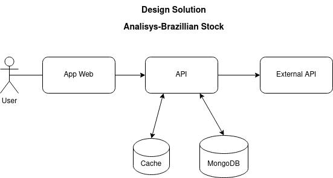

# spring-boot-brazilian-stock-analisys

> Spring boot with Kotlin, Spring Boot, Cache, WebClient, Swagger and Heroku Cloud

## Design Solution



## FrontEnd Deployed to Vercel
https://analisys-brazilian-stock-front.vercel.app/

## FrontEnd Source
https://github.com/sartorileonardo/analisys-brazilian-stock-front

## Run Application

`mvn spring-boot:run`

## Swagger localhost documentation

http://localhost:8888/swagger-ui/index.html#

## Swagger heroku documentation

https://analisys-brazilian-stock.herokuapp.com/swagger-ui/index.html#

## Postman

> <code>[postman/postman_collection.json](postman/postman_collection.json)</code>

## application.yml

```yaml
config:

  setoresParenes: [
    "utilidade-publica",
    "materiais-basicos",
    "financeiro-e-outros",
    "saude" ]

  minimoFreeFloat: 25.00
  minimoROE: 10.00
  minimoCagrLucro5anos: 15.00
  minimoMargemLiquida: 10.00
  minimoMargemEbit: 20.00
  minimoLiquidez: 1
  maximoDividaLiquidaSobrePatrimonioLiquido: 2.00
  maximoDividaLiquidaSobreEbit: 2.50
  maximoPrecoSobreLucro: 15.00
  maximoPrecoSobreValorPatrimonial: 3.00

  tickersMostTraded: [
    "VALE3",
    "ITUB3",
    "PETR3",
    "BBDC3",
    "B3SA3",
    "ABEV3",
    "MGLU3",
    "VIIA3",
    "ITSA3",
    "BBAS3",
    "HAPV3",
    "COGN3",
    "ELET3",
    "CIEL3",
    "RENT3",
    "CPLE3",
    "WEGE3",
    "EGIE3",
    "BPAC3",
    "BRFS3",
    "CCRO3",
    "CMIG3",
    "CSNA3",
    "CVCB3",
    "CYRE3",
    "EQTL3",
    "GGBR3",
    "GNDI3",
    "GOAU3",
    "JBSS3",
    "KLBN3",
    "LAME3",
    "MRFG3",
    "RADL3",
    "RAIL3",
    "SBSP3",
    "SULA3",
    "SUZB3",
    "TOTS3",
    "UGPA3",
    "USIM3"
  ]

  databaseName: ${DATABASE_NAME}
  urlDatabase: ${URL_DATABASE}
  timeoutDatabase: 60000

  urlExternalAPI: ${URL_EXTERNAL_API}

  timeoutExternalAPI: 10000
  timeMinRetry: 2000
  timeMaxRetry: 5000
  maxAttempsRetry: 3

  messageTickerNotFound: "Sorry, the ticker not found!"
  messageConnectionFail: "Sorry, the connection whith external API is fail. Retry again after 1 minute!"

server:
  port: 8888

logging:
  level:
    ROOT: INFO


```

## StockAnalisysDto.java

```kotlin
data class StockAnalysisDTO(
    val ticker: String,
    val estaEmSetorPerene: Boolean,
    val estaForaDeRecuperacaoJudicial: Boolean,
    val possuiBomNivelRetornoSobrePatrimonio: Boolean,
    val possuiBomNivelCrescimentoLucroNosUltimos5Anos: Boolean,
    val possuiBomNivelMargemLiquida: Boolean,
    val possuiBomNivelMargemEbit: Boolean,
    val possuiBomNivelDeCapacidadeDeQuitarDividaNoCurtoPrazo: Boolean,
    val possuiBomNivelDividaLiquidaSobrePatrimonioLiquido: Boolean,
    val possuiBomPrecoEmRelacaoAoValorPatrimonial: Boolean,
    val possuiBomNivelPassivosSobreAtivos: Boolean,
    val nomeEmpresa: String? = null,
    val segmentoEmpresa: String? = null,
    val avaliacaoGeral: AvaliacaoGeral? = null
) {
    companion object {
        fun toEntity(dto: StockAnalysisDTO): StockAnalysisEntity {
            return StockAnalysisEntity(
                ticker = dto.ticker,
                estaEmSetorPerene = dto.estaEmSetorPerene,
                estaForaDeRecuperacaoJudicial = dto.estaForaDeRecuperacaoJudicial,
                possuiBomNivelRetornoSobrePatrimonio = dto.possuiBomNivelRetornoSobrePatrimonio,
                possuiBomNivelCrescimentoLucroNosUltimos5Anos = dto.possuiBomNivelCrescimentoLucroNosUltimos5Anos,
                possuiBomNivelMargemLiquida = dto.possuiBomNivelMargemLiquida,
                possuiBomNivelMargemEbit = dto.possuiBomNivelMargemEbit,
                possuiBomNivelDeCapacidadeDeQuitarDividaNoCurtoPrazo = dto.possuiBomNivelDeCapacidadeDeQuitarDividaNoCurtoPrazo,
                possuiBomNivelDividaLiquidaSobrePatrimonioLiquido = dto.possuiBomNivelDividaLiquidaSobrePatrimonioLiquido,
                possuiBomPrecoEmRelacaoAoValorPatrimonial = dto.possuiBomPrecoEmRelacaoAoValorPatrimonial,
                possuiNegociacaoAtiva = dto.possuiBomNivelPassivosSobreAtivos,
                nomeEmpresa = dto.nomeEmpresa,
                segmentoEmpresa = dto.segmentoEmpresa,
                avaliacaoGeral = dto.avaliacaoGeral
            )
        }
    }

}
```

## StockService.java

```kotlin
@Service
class StockService(val acaoConfig: StockParametersApiConfig, val repository: StockAnalysisRepository) {

    companion object {
        var LOGGER: Logger? = LoggerFactory.getLogger(StockService::class.java)
    }

    @Cacheable(value = ["analise"])
    fun getAnalisys(ticker: String): Mono<StockAnalysisDTO> {

        TickerValidation().validarTicker(ticker.trim())

        if (repository.existsById(ticker).block()!!) {
            return repository.findById(ticker)
                .map {
                    it.avaliacaoGeral = getAvaliacaoGeral(it.toString())
                    StockAnalysisEntity.toDTO(it)
                }
                .doOnSuccess { LOGGER?.info("Analysis from database performed successfully: $ticker") }
                .doOnError { LOGGER?.error("Analysis from database did find an error $ticker: \nCause: ${it.message} \nMessage: ${it.message}") }
        }

        val entity = StockAnalysisDTO.toEntity(getExternalAnalisys(ticker))

        return repository.save(entity)
            .map {
                it.avaliacaoGeral = getAvaliacaoGeral(it.toString())
                StockAnalysisEntity.toDTO(it)
            }
            .doOnSuccess { LOGGER?.info("Analysis from external API performed and save successfully: $ticker") }
            .doOnError { LOGGER?.error("Analysis from external API did find an error and don't save $ticker: \nCause: ${it.message} \nMessage: ${it.message}") }
    }

    @Scheduled(fixedRate = 604800000)
    fun getAnalisysToTickersMostTraded() {
        acaoConfig.tickersMostTraded.forEach { ticker -> this.getAnalisys(ticker) }
        LOGGER!!.info("Loaded tickers most traded...\n")
    }

    @Scheduled(cron = "0 0 12 1 * ?")
    fun cleanRepository() {
        repository.deleteAll()
        LOGGER!!.info("Repository is cleaned...\n")
    }

    private fun getAvaliacaoGeral(analisyToString: String): AvaliacaoGeral {
        val positivesPoints = StringUtils.countOccurrencesOf(analisyToString, "true")
        val otimoRange = 8..10
        val bomRange = 6..7
        val regularRange = 3..5
        val ruimRange = 0..2

        when (positivesPoints) {
            in ruimRange -> return AvaliacaoGeral.RUIM
            in regularRange -> return AvaliacaoGeral.REGULAR
            in bomRange -> return AvaliacaoGeral.BOM
            in otimoRange -> return AvaliacaoGeral.OTIMO
            else -> return AvaliacaoGeral.INDEFINIDO
        }
    }

    fun getExternalAnalisys(ticker: String): StockAnalysisDTO {
        val responseDTO = ResponseDTO.parseMapToDto(StockWebClient(acaoConfig, ticker).getContentFromAPI())
        val indicatorsTicker = responseDTO.indicatorsTicker
        val valuation = responseDTO.valuation
        val paper = responseDTO.paper
        val indicadoresAlternativos = paper?.indicadores
        val indicadorAlternativoPL = indicadoresAlternativos?.get(0)?.Value_F
        val indicadorAlternativoPVP = if(indicadoresAlternativos?.get(1)?.Value_F == null) extrairDouble(valuation?.pvp.toString()) else extrairDouble(indicadoresAlternativos.get(1).Value_F!!)
        val precoSobreValorPatrimonial = extrairDouble(listOfNotNull(indicatorsTicker?.pvp, indicadorAlternativoPVP, valuation?.pvp).distinct().first().toString())
        val company = responseDTO.company

        val margemLiquida = extrairDouble(company?.margemLiquida.toString())
        val roe = extrairDouble(company?.roe.toString())
        val cagrLucro = extrairDouble(company?.lucros_Cagr5.toString())
        val setorAtuacaoClean = company?.setor_Atuacao_clean.toString()
        val estaEmRecuperacaoJudicial = company?.injudicialProcess.toString().toBoolean()
        val liquidezCorrente = extrairDouble(company?.liquidezCorrente.toString())
        val dividaLiquidaSobrePatrimonioLiquido = extrairDouble(company?.dividaliquida_PatrimonioLiquido.toString())
        val passivosAtivos = extrairDouble(responseDTO.otherIndicators?.passivosAtivos.toString())
        val margemEbit = extrairDouble(responseDTO.otherIndicators?.margemEbit.toString())

        return StockAnalysisDTO(
            ticker,
            estaEmSetorPerene(setorAtuacaoClean),
            estaForaDeRecuperacaoJudicial(estaEmRecuperacaoJudicial),
            possuiBomNivelRetornoSobrePatrimonio(roe),
            possuiBomNivelCrescimentoLucroNosUltimos5Anos(cagrLucro),
            possuiBomNivelMargemLiquida(margemLiquida),
            possuiBomNivelMargemEbit(margemEbit),
            possuiBomNivelLiquidezCorrente(liquidezCorrente),
            possuiBomNivelDividaLiquidaSobrePatrimonioLiquido(dividaLiquidaSobrePatrimonioLiquido),
            possuiBomPrecoEmRelacaoAoValorPatrimonial(precoSobreValorPatrimonial),
            possuiBomNivelPassivosSobreAtivos(passivosAtivos),
            company?.bookName,
            company?.segmento_Atuacao
        )

    }

    private fun possuiBomNivelMargemEbit(margemEbit: Double) = margemEbit.compareTo(acaoConfig.minimoMargemLiquida.toDouble()) >= 1
    private fun possuiBomNivelPassivosSobreAtivos(passivosAtivos: Double) = passivosAtivos.compareTo(1) <= 1

    private fun possuiBomNivelFreeFloat(freeFloat: Double) =
        freeFloat.compareTo(acaoConfig.minimoFreeFloat.toDouble()) >= 1

    private fun possuiBomNivelCrescimentoLucroNosUltimos5Anos(cagr: Double) =
        cagr.compareTo(acaoConfig.minimoCagrLucro5anos.toDouble()) >= 1

    private fun possuiBomNivelRetornoSobrePatrimonio(roe: Double) = roe.compareTo(acaoConfig.minimoROE.toDouble()) >= 1

    private fun estaEmSetorPerene(setorDeOperacao: String) = acaoConfig.setoresParenes.contains(setorDeOperacao)

    private fun possuiBomNivelMargemLiquida(margemLiquida: Double) =
        margemLiquida.compareTo(acaoConfig.minimoMargemLiquida.toDouble()) >= 1

    private fun possuiBomNivelDividaLiquidaSobrePatrimonioLiquido(dividaLiquidaSobrePatrimonioLiquido: Double) =
        dividaLiquidaSobrePatrimonioLiquido.compareTo(acaoConfig.maximoDividaLiquidaSobrePatrimonioLiquido.toDouble()) < 1

    private fun possuiBomNivelDividaLiquidaSobreEbitda(dividaLiquidaSobreEbitda: Double) =
        dividaLiquidaSobreEbitda.compareTo(0.00) >= 1 && dividaLiquidaSobreEbitda.compareTo(acaoConfig.maximoDividaLiquidaSobreEbitda.toDouble()) <= 1

    private fun estaForaDeRecuperacaoJudicial(estaEmRecuperacaoJudicial: Boolean) = !estaEmRecuperacaoJudicial

    private fun possuiBomNivelLiquidezCorrente(liquidezCorrente: Double) =
        liquidezCorrente.compareTo(1.00) >= acaoConfig.minimoLiquidez.toInt()

    private fun possuiBomPrecoEmRelacaoAoValorPatrimonial(precoSobreValorPatrimonial: Double) = possuiBomNivelPrecoSobreValorPatrimonial(precoSobreValorPatrimonial)

    private fun possuiBomNivelPrecoSobreValorPatrimonial(precoSobreValorPatrimonial: Double) =
        precoSobreValorPatrimonial.compareTo(0.00) >= 1 && precoSobreValorPatrimonial in 0.10..acaoConfig.maximoPrecoSobreValorPatrimonial.toDouble()

    private fun possuiBomNivelPrecoSobreLucro(precoSobreLucro: Double) =
        precoSobreLucro.compareTo(0.00) >= 1 && precoSobreLucro in 0.10..acaoConfig.maximoPrecoSobreLucro.toDouble()

    private fun possuiDireitoDeVendaDeAcoesIgualAoAcionistaControlador(tagAlong: Double) = tagAlong.toInt() == 100

    private fun extrairDouble(texto: String): Double =
        if (StringUtil.isNullOrEmpty(texto) || texto == "-") 0.00 else requireNotNull(texto).trim()
            .replace(",", ".")
            .replace("%", "")
            .toDouble()

}
```

## StockController.java

```kotlin
@CrossOrigin(origins = ["*"])
@RestController
@RequestMapping("/stock")
@Api(description = "Analise de empresa brasileira de capital aberto")
class StockController @Autowired constructor(val service: StockService){
    @GetMapping("/analisys/{ticker}")
    fun getAnalisys(@PathVariable ticker: String) = service.getAnalisys(ticker)
}
```

## StockControllerTest.java

```kotlin
@SpringBootTest
@AutoConfigureMockMvc
class StockControllerTest(@Autowired val mockMvc: MockMvc) {
    private val urlValidApi: String = "/stock/analisys/"
    private val urlInvalidApi: String = "/stock/analisys/ticker"
    private val exampleValidTicker: String = "ABEV3"
    private val exampleInvalidTicker: String = "ABEVV"
    private val exampleNotFoundTicker: String = "ABEV5"


    @Test
    fun findAnalisysWhenReturnIs200Code() {
        mockMvc.perform(get("${urlValidApi}${exampleValidTicker}")
            .contentType(MediaType.APPLICATION_JSON))
            .andExpect(status().isOk)
    }

    @Test
    fun findAnalisysWhenReturnIs400Code(){
        mockMvc.perform(get("${urlValidApi}${exampleInvalidTicker}")
            .contentType(MediaType.APPLICATION_JSON))
            .andExpect(status().isBadRequest)
    }

    @Test
    fun findAnalisysWhenReturnIs404Code(){
        mockMvc.perform(get("${urlInvalidApi}${exampleValidTicker}")
            .contentType(MediaType.APPLICATION_JSON))
            .andExpect(status().isNotFound)
    }

}
```

## TickerValidation.java

```kotlin
class TickerValidation {
    fun validarTicker(ticker: String): Boolean {
        return validarSeForVazio(ticker)
            .and(validarSePossuiSomenteNumeros(ticker))
            .and(validarSePossuiSomenteNumeros(ticker))
            .and(validarSePossuiSomenteLetras(ticker))
            .and(validarSeTerminaComDigitoAceito(ticker))
            .and(validarSeForBDR(ticker))
    }

    private fun validarSeForBDR(ticker: String) = if(listOf("32", "33", "34", "35").contains(ticker.substring(ticker.length - 2))) throw BusinessException("O sistema não suporta ticker de BDR's, tente novamente com um ticker de empresa brasileira!") else true

    private fun validarSeTerminaComDigitoAceito(ticker: String) = if(!listOf("3", "4").contains(ticker.last().toString()) && ticker.substring(ticker.length - 2) != "11")
        throw BusinessException("Ticker deve terminar com 3, 4 ou 11, exemplo: ABEV3, BBDC4, TAEE11!") else true

    private fun validarSePossuiSomenteLetras(ticker: String) = if(ticker.matches(Regex("^[a-zA-Z]+\$"))) throw BusinessException("Ticker não pode ser somente letras!") else true

    private fun validarSePossuiSomenteNumeros(ticker: String) = if(ticker.matches(Regex("\\d+"))) throw BusinessException("Ticker não pode ser somente numeros!") else true

    private fun validarSeForVazio(ticker: String) = if(ticker.isNullOrBlank()) throw BusinessException("Ticker é obrigatório!") else true
}
```
